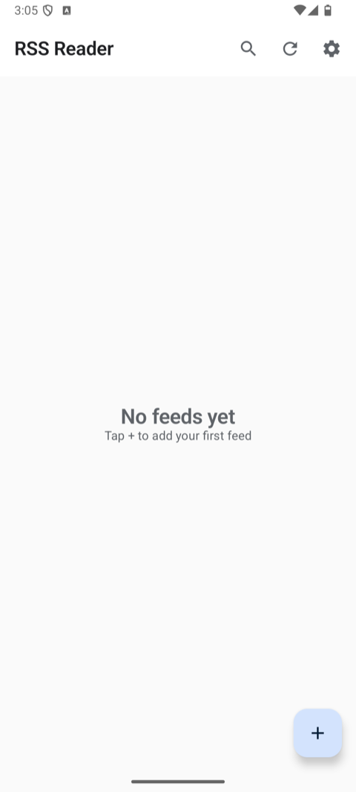
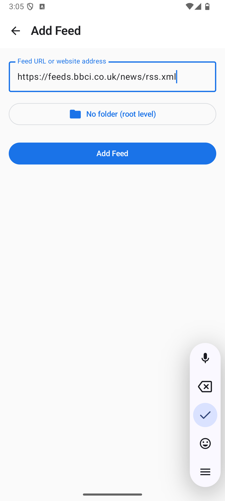
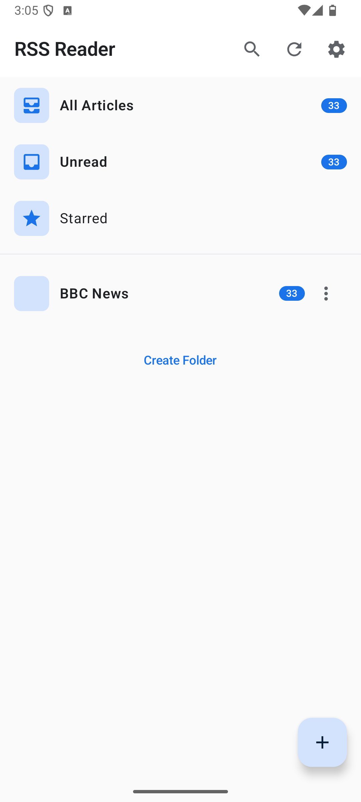
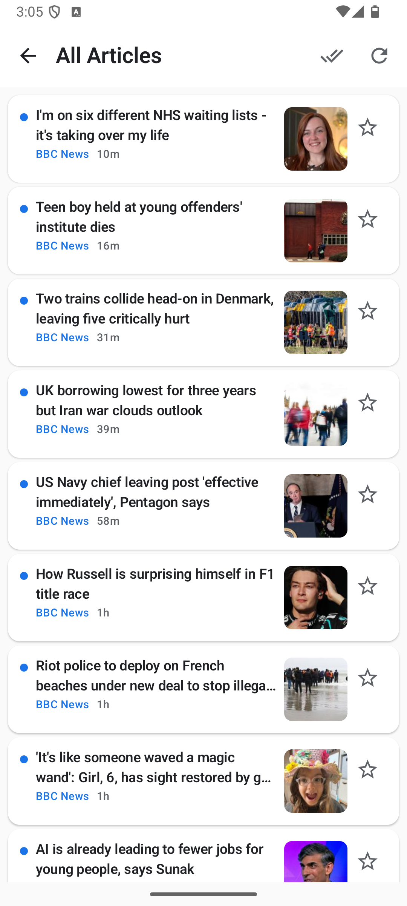

<p align="center">
  
</p>

# RSS Reader

A modern, clean RSS/Atom feed reader for Android inspired by NetNewsWire. Built with Jetpack Compose and Material Design 3.

## Features

### Feed Management
- Add feeds via URL or auto-discover from website
- Organize feeds into folders
- OPML import/export for portability
- Pull-to-refresh for manual sync

### Article Reading
- Clean, distraction-free reader with beautiful typography
- Inter font for optimal readability
- Full HTML rendering with proper formatting
- Dark mode optimized (OLED-friendly)
- Share articles or open in browser

### Smart Feeds
- **All Articles** - Everything in one place
- **Unread** - Focus on what's new
- **Starred** - Save important articles

### Background Sync
- Automatic hourly refresh via WorkManager
- Notifications for new articles
- Battery-efficient scheduling

### Search
- Full-text search across all articles
- Search by title, content, or summary

## Screenshots

A visual walkthrough of the app.

<table align="center">
  <tr>
    <td align="center" width="25%"><br/><sub>Empty home</sub></td>
    <td align="center" width="25%"><br/><sub>Add feed</sub></td>
    <td align="center" width="25%"><br/><sub>Feeds list</sub></td>
    <td align="center" width="25%"><br/><sub>Articles</sub></td>
  </tr>
</table>

## Tech Stack

- **UI**: Jetpack Compose with Material 3
- **Architecture**: MVVM with Repository pattern
- **Database**: Room with Flow for reactive updates
- **Networking**: OkHttp + custom RSS/Atom parser
- **Background**: WorkManager for periodic sync
- **Image Loading**: Coil
- **Dependency Injection**: Manual (no framework)

## Requirements

- Android 8.0 (API 26) or higher
- Internet connection for fetching feeds

## Building

1. Clone the repository
2. Open in Android Studio (Hedgehog or newer)
3. Sync Gradle files
4. Run on device or emulator

```bash
./gradlew assembleDebug
```

## Project Structure

```
app/src/main/java/com/example/rssreader/
├── data/
│   ├── local/
│   │   ├── dao/          # Room DAOs
│   │   ├── database/     # Room Database
│   │   └── entity/       # Room Entities
│   └── repository/       # Repository implementation
├── domain/
│   └── model/            # Domain models
├── network/
│   ├── FeedDiscovery.kt  # Auto-discover feeds
│   └── RssParser.kt      # RSS/Atom parser
├── ui/
│   ├── components/       # Reusable UI components
│   ├── navigation/       # Navigation setup
│   ├── screens/          # Screen composables
│   └── theme/            # Material theme, colors, typography
├── util/
│   └── OpmlManager.kt    # OPML import/export
├── worker/
│   └── SyncWorker.kt     # Background sync
├── MainActivity.kt
└── RssReaderApp.kt       # Application class
```

## Adding Feeds

### Via URL
1. Tap the + button
2. Enter the feed URL or website URL
3. Select a folder (optional)
4. Tap "Add Feed"

### Via Share Intent
Share any URL from your browser to RSS Reader - it will attempt to discover and add the feed.

### Via OPML Import
1. Go to Settings
2. Tap "Import feeds (OPML)"
3. Select your OPML file

## Future Features

- AI summary button for articles
- AI TTS functionality for accessibility

## License

This project is for personal use.

## Acknowledgments

- Inspired by [NetNewsWire](https://netnewswire.com/)
- Typography: [Inter](https://rsms.me/inter/) by Rasmus Andersson
